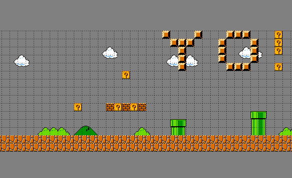

# level2map
Purpose of this repository is to convert a single image of a 2D level into a complete map (tilesheet image anlong with data file).

## Dependencies
	* Python
	* TexturePacker command line

Levels can be downloaded from [http://vgmaps.com/].

## Procedure
#### 1. Download a map
  vgmaps.com is a perfect source
  
#### 2. Cleaning the level with Image Editor
The map you downloaded may have stichting issues. For example, a row of pixels may have been duplicated. The level2map tool is very basic, so removing these artefacts is necessary.
 
#### 3. Run level2map
```sh
$ python level2map.py level.png data/ 16
```
The tool will scan the leve.png image and find all unique tiles and place them in a temporary directory. It will then execute TexturePacker and place data file and tilesheet in your data/ directory.

#### 4. Open Tiled
Open Tiled and load the data file from level2map.



### Version
1.0
